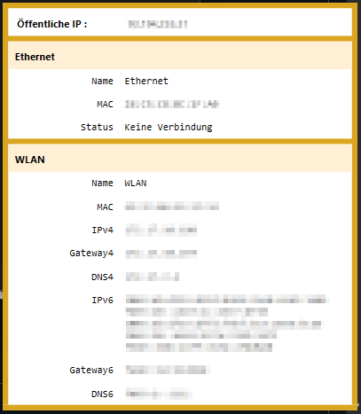
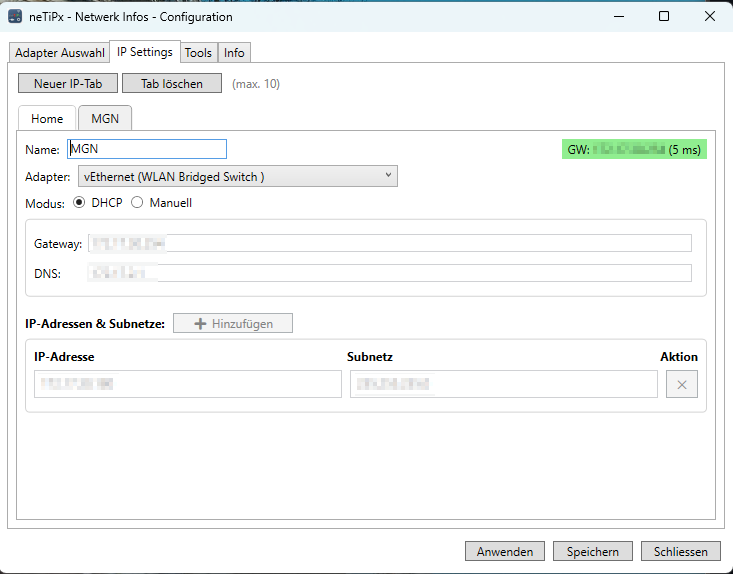

## neTiPx — Netzwerk-Info Tool (C#)



Kurze Beschreibung
-------------------
`neTiPx` ist ein kleines Windows-Tool (WPF, C#), das Netzwerkadapter aus einer Konfigurationsdatei lädt, deren Status anzeigt und einfache IP-Konfigurationen verwalten kann. Die App läuft im System Tray und zeigt u. a. externe IPv4-Adresse, lokale IPv4-/IPv6-Adressen, MAC-Adresse, Gateway und DNS-Server an.

Wesentliche Funktionen
----------------------

### Netzwerk-Übersicht (Tray-Popup)
- **Automatische Anzeige** bei Mausüberfahrt über das Tray-Icon
- Anzeige der **externen IPv4-Adresse** (mit Fallback-Diensten)
- Details zu **zwei konfigurierbaren Netzwerkadaptern**:
  - Name, MAC-Adresse
  - IPv4/IPv6-Adressen
  - Gateway (IPv4/IPv6)
  - DNS-Server

### Adapter-Auswahl
- Auswahl von **bis zu 2 physikalischen Netzwerkadaptern**
- Automatische Erkennung aller verfügbaren Adapter

### IP-Profil-Verwaltung
- **Mehrere IP-Konfigurationen** als separate Tabs (max. 10)
- Jedes Profil mit editierbarem Namen
- **Modus-Auswahl**: DHCP oder Manuell (IPv4)
- Bei manueller Konfiguration:
  - **Einzelne Gateway-Adresse** pro Profil
  - **Einzelne DNS-Adresse** pro Profil
  - **Mehrere IP/Subnetz-Kombinationen** pro Profil
    - Hinzufügen weiterer IPs mit "➕ Hinzufügen"-Button
    - Entfernen einzelner IPs mit "✕"-Button
- **Intelligente Validierung**:
  - Überprüft IP-Adressen und Subnetmasken auf Gültigkeit
  - Stellt sicher, dass Gateway im gleichen Subnetz wie die erste IP liegt
  - Zeigt detaillierte Fehlermeldungen bei ungültigen Eingaben
- **Gateway-Erreichbarkeitsprüfung**
  - Zeigt Ping-Status mit RTT in ms
- **Ein-Klick-Anwendung** auf Netzwerkkarte (erfordert Admin-Rechte)
  - Setzt erste IP als Primär-Adresse
  - Fügt zusätzliche IPs automatisch hinzu

### Ping-Monitor (Tools → Ping)
- **Bis zu 6 gleichzeitige Ping-Überwachungen**
- Unterstützt **IPv4-Adressen UND DNS-Hostnamen** (z.B. google.com)
- Pro Eintrag:
  - Aktivierung per Checkbox
  - Eingabe: IP-Adresse oder Hostname
  - Live-Statistiken: Startzeit, fehlende Pakete, Paketverlust %, aktueller Status
  - RTT-Anzeige in ms bei erfolgreichen Pings
  - Reset-Funktion (↻) und Löschen-Funktion pro Zeile
- **Hintergrund-Modus**:
  - Im Hintergrund Ping-Überwachung weiterlaufen

### WiFi-Netzwerke (Tools → WiFi Netzwerke)
- **Aktiver Netzwerk-Scan** mit Native WiFi API
- **Alle Netzwerke anzeigen** in sortbarer Tabelle:
  - Signal-Symbol (📶/📳/📴/❌) und Signalstärke
  - SSID, BSSID (MAC-Adresse)
  - Signalstärke in dBm und Prozent
- **Sortierung** nach jeder Spalte durch Klick auf Spaltenüberschrift
- **Doppelklick auf Netzwerk** öffnet Detail-Fenster mit:
  - Netzwerktyp (Infrastructure/Ad-Hoc)
  - Verschlüsselung, Kanal, Frequenz, PHY-Typ (802.11a/b/g/n/ac/ax)
  - Link Quality, Beacon-Intervall
  - Unterstützte Datenraten
  - Technische Details (Capabilities, Regulatory Domain)

Konfiguration (`config.ini`)
---------------------------
---------------------------
Die App liest und speicher alles in `config.ini` aus dem Anwendungsverzeichnis. Beispiel:

```
Adapter1 = Ethernet
Adapter2 = WLAN
IpProfileNames = Office,Home
Office.Adapter = Ethernet
Office.Mode = Manual
Office.IP_1 = 192.168.1.50
Office.Subnet_1 = 255.255.255.0
Office.IP_2 = 192.168.1.51
Office.Subnet_2 = 255.255.255.0
Office.GW = 192.168.1.1
Office.DNS = 8.8.8.8
Home.Adapter = WLAN
Home.Mode = DHCP
```

**Hinweis:** Pro Profil können beliebig viele IP/Subnetz-Kombinationen definiert werden (`IP_1`/`Subnet_1`, `IP_2`/`Subnet_2`, etc.). Gateway und DNS gelten für alle IPs des Profils.


## IP Settings (Config-Fenster)
---------------------------
Bereich `IP Settings`, in dem du mehrere IP-Profile als Tabs anlegen kannst. Jedes Profil enthält:

- Ein editierbarer Profilname (wird als Schlüssel in `config.ini` verwendet)
- Auswahl eines Adapters (gefüllt aus `Adapter1`/`Adapter2`)
- Modus: `DHCP` oder `Manuell` (nur IPv4)
- Bei `Manuell`:
  - **Gateway-Feld** (einmalig pro Profil, gilt für alle IPs)
  - **DNS-Feld** (einmalig pro Profil)
  - **IP-Adressen & Subnetze Tabelle**:
    - Mehrere Zeilen für verschiedene IP/Subnetz-Kombinationen
    - "➕ Hinzufügen"-Button zum Hinzufügen neuer IP-Adressen (nur im Manuell-Modus aktiv)
    - "✕"-Button zum Entfernen einzelner IP-Einträge
  - **Automatische Validierung** beim Speichern und Anwenden




## Anwenden einer Konfiguration
----------------------------
- Wähle das gewünschte Profil-Tab und klicke `Anwenden`.
- Die App validiert automatisch:
  - Gültigkeit der IP-Adressen und Subnetmasken
  - Ob das Gateway im gleichen Subnetz wie die erste IP liegt
  - Bei Fehlern werden detaillierte Meldungen angezeigt
- Die Konfiguration wird auf die Netzwerkkarte geschrieben:
  - Erste IP wird als Primär-Adresse gesetzt
  - Weitere IPs werden als zusätzliche Adressen hinzugefügt
  - Gateway und DNS werden konfiguriert
- Angewendete Profile werden grün markiert


## Weitere Hinweise
----------------
- Für das Anwenden von IP-Konfigurationen wird `netsh` verwendet; die App fordert beim Ausführen der Änderung Administratorrechte an.
- Beim Speichern werden die IP-Profile in `config.ini` (Schlüssel `IpProfileNames` und `<ProfileName>.<Feld>`) persistiert.
- **Mehrere IPs:** Pro Profil können mehrere IP-Adressen konfiguriert werden (z.B. `Office.IP_1`, `Office.IP_2`, etc.)
- **Validierung:** Die App überprüft automatisch, ob Gateway und IP-Adressen im selben Subnetz liegen
- **DHCP-Modus:** Im DHCP-Modus sind die IP-Eingabefelder und der "Hinzufügen"-Button deaktiviert

### Lizenz & Kontakt
----------------
Siehe `LICENSE` im Repository. Für Fragen zum Code bitte Issues/PRs im Repo verwenden.

https://buymeacoffee.com/pedrotepe
